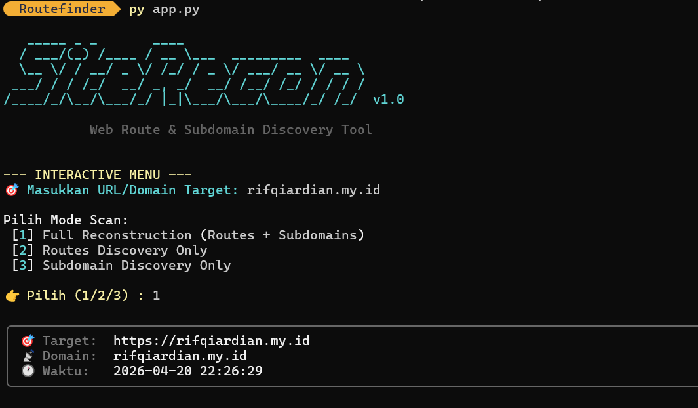

# 🔍 SiteRecon

**Web Route & Subdomain Discovery Tool** — Program Python untuk menemukan semua route/endpoint dan subdomain aktif dari sebuah website.



---

## ✨ Fitur

| Fitur | Deskripsi |
|-------|-----------|
| 🕷️ **Route Crawler** | Crawl otomatis semua halaman dan ekstrak path/endpoint |
| 📄 **robots.txt & sitemap.xml** | Parse otomatis untuk menemukan route yang disembunyikan |
| ⚡ **JS Route Extractor** | Ekstrak route dari kode JavaScript di halaman |
| 📝 **Form Endpoint Finder** | Temukan semua form beserta method (GET/POST) |
| 🌐 **Subdomain DNS Brute-force** | Cek 100+ subdomain umum secara paralel |
| 🔐 **crt.sh Certificate Transparency** | Cari subdomain dari database sertifikat SSL |
| 🎯 **HackerTarget API** | Sumber tambahan subdomain dari OSINT |
| 💾 **Export TXT Report** | Simpan laporan hasil scan ke file .txt yang rapi |

---

## 🚀 Instalasi

```bash
cd SiteRecon
py -m pip install -r requirements.txt
```

---

## 📖 Cara Penggunaan

### Scan penuh (route + subdomain)
```bash
py app.py -u example.com
```

### Hanya cari routes
```bash
py app.py -u example.com --routes-only
```

### Hanya cari subdomain
```bash
py app.py -u example.com --subdomain-only
```

### Simpan output ke file tertentu
```bash
py app.py -u example.com -o laporan.txt
```

---

## ⚙️ Opsi Lengkap

```
  -u, --url           Target URL atau domain (wajib)
  -d, --depth         Kedalaman crawl (default: 3)
  -p, --max-pages     Maks halaman di-crawl (default: 200)
  -t, --timeout       Timeout request dalam detik (default: 10)
  --delay             Delay antar request (default: 0.3)
  -T, --threads       Jumlah thread subdomain scan (default: 50)
  -w, --wordlist      Path ke file wordlist subdomain
  --no-crt            Nonaktifkan crt.sh lookup
  --routes-only       Hanya route discovery
  --subdomain-only    Hanya subdomain discovery
  --external          Crawl link eksternal juga
  -o, --output        Simpan hasil ke file TXT
```

---

## 📁 Contoh Isi Laporan (.txt)

```text
============================================================
 SITE RECON REPORT - 2024-04-20 22:20:00
============================================================

[+] TARGET: https://example.com
[+] TOTAL ROUTES: 12

--- ROUTES DISCOVERED ---
/
/about
/login
...

============================================================

[+] DOMAIN: example.com
[+] TOTAL SUBDOMAINS: 5

--- ACTIVE SUBDOMAINS ---
SUBDOMAIN                                | IP ADDRESSES                   | STATUS
--------------------------------------------------------------------------------
www.example.com                          | 93.184.216.34                  | 200
api.example.com                          | 93.184.216.35                  | 200
```

---

## ⚠️ Disclaimer

Tool ini hanya untuk tujuan **edukasi** dan **pengujian keamanan yang sah** pada sistem yang Anda miliki atau memiliki izin untuk diuji. Penggunaan tanpa izin pada sistem orang lain adalah **ilegal**.
